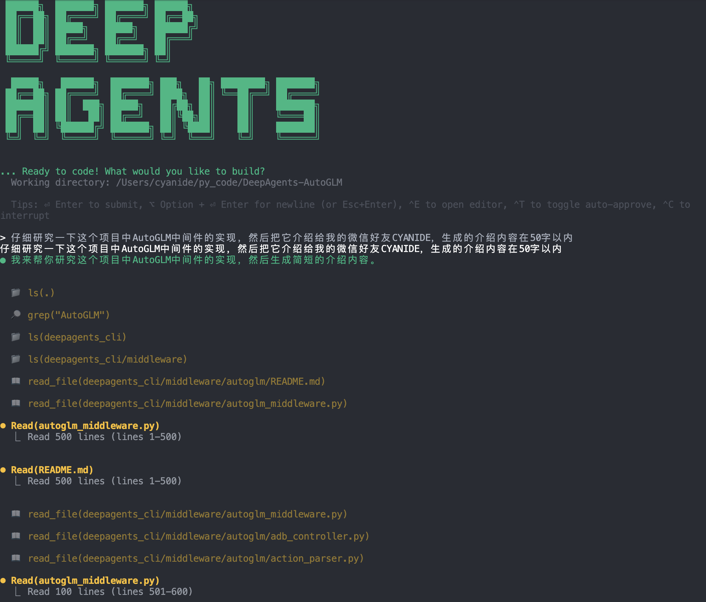

# 🚀🧠 DeepAgents-AutoGLM

[English](./README_EN.md) | 中文

基于 [deepagents](https://github.com/langchain-ai/deepagents) 框架集成 [AutoGLM](https://github.com/zai-org/Open-AutoGLM) 手机控制能力的开源智能助手，可在终端中运行，并支持 Android 设备自动化控制。

**核心特性：**
- **内置工具集**: 文件操作（读、写、编辑、搜索）、Shell 命令、网络搜索、子代理委托
- **可定制技能**: 通过渐进式披露技能系统添加特定领域能力
- **持久化记忆**: Agent 会记住您的偏好、编码风格和项目上下文
- **项目感知**: 自动检测项目根目录并加载项目特定配置
- **Android 自动化**（可选）: 集成 AutoGLM 实现智能手机控制（点击、滑动、输入等）
- **视觉引导控制**（可选）: 使用视觉-语言模型理解和操作手机 GUI 



## 🚀 快速开始

### 基础安装

克隆本项目并安装依赖。

**使用 pip 安装：**
```bash
# 克隆仓库
git clone git@github.com:Illuminated2020/DeepAgents-AutoGLM.git
cd DeepAgents-AutoGLM

# 安装基础依赖
pip install -e .
```

**或使用 uv（推荐）：**
```bash
# 克隆仓库
git clone git@github.com:Illuminated2020/DeepAgents-AutoGLM.git
cd DeepAgents-AutoGLM

# 创建虚拟环境并安装
uv venv
source .venv/bin/activate  # Linux/macOS
# 或 .venv\Scripts\activate  # Windows
uv pip install -e .
```

**在终端中运行 Agent：**
```bash
deepagents
```

**获取帮助：**
```bash
deepagents help
```

**常用选项：**
```bash
# 使用特定的 Agent 配置
deepagents --agent mybot

# 创建新的 Agent
deepagents create mybot

# 列出所有 Agent
deepagents list

# 自动批准工具使用（跳过人工确认提示）
deepagents --auto-approve

# 在远程沙箱中执行代码（需要配置）
deepagents --sandbox modal        # 或 runloop, daytona
deepagents --sandbox-id dbx_123   # 重用现有沙箱

# 管理技能
deepagents skills list            # 列出所有技能
deepagents skills create my-skill # 创建新技能
```

像在聊天界面中一样自然输入。Agent 将使用其内置工具、技能和记忆来帮助您完成任务。

### AutoGLM 安装（可选 - Android 自动化）

如果需要使用 Android 设备自动化功能，请安装 AutoGLM 支持。

> **注意**: AutoGLM 是可选功能，不安装也不影响 deepagents-cli 的其他功能使用。

**安装 AutoGLM 依赖：**
```bash
# 在项目根目录下
# 使用 pip
pip install -e ".[autoglm]"

# 或使用 uv
uv pip install -e ".[autoglm]"
```

**安装 ADB 工具：**
```bash
# macOS
brew install android-platform-tools

# Ubuntu/Debian
sudo apt-get install android-tools-adb

# Windows
# 从 https://developer.android.com/studio/releases/platform-tools 下载
```

**配置环境变量：**

复制 `.env.example` 为 `.env` 并配置：

```bash
cp .env.example .env
```

编辑 `.env` 文件，至少配置以下项：

```bash
# 基础 LLM 配置
OPENAI_API_KEY=your-api-key
OPENAI_MODEL=gpt-4

# AutoGLM 配置
AUTOGLM_ENABLED=true
AUTOGLM_VISION_MODEL_URL=http://localhost:8000/v1  # 或智谱 AI URL
AUTOGLM_VISION_MODEL_NAME=autoglm-phone-9b
AUTOGLM_VISION_API_KEY=EMPTY  # 本地部署使用 EMPTY
```

详细配置说明请参考 [.env.example](.env.example) 文件。

**启动视觉模型（本地部署）：**

```bash
python3 -m vllm.entrypoints.openai.api_server \
  --served-model-name autoglm-phone-9b \
  --allowed-local-media-path / \
  --mm-encoder-tp-mode data \
  --mm_processor_cache_type shm \
  --mm_processor_kwargs '{"max_pixels":5000000}' \
  --max-model-len 25480 \
  --chat-template-content-format string \
  --limit-mm-per-prompt '{"image":10}' \
  --model zai-org/AutoGLM-Phone-9B \
  --port 8000
```

或使用智谱 AI 云端 API（无需本地部署）：

```bash
AUTOGLM_VISION_MODEL_URL=https://open.bigmodel.cn/api/paas/v4
AUTOGLM_VISION_MODEL_NAME=autoglm-phone
AUTOGLM_VISION_API_KEY=your-zhipu-api-key
``` 

## 内置工具

Agent 自带以下内置工具（无需配置即可使用）：

### 基础工具

| 工具 | 描述 |
|------|-------------|
| `ls` | 列出文件和目录 |
| `read_file` | 读取文件内容 |
| `write_file` | 创建或覆写文件 |
| `edit_file` | 对现有文件进行针对性编辑 |
| `glob` | 查找匹配模式的文件（例如 `**/*.py`） |
| `grep` | 跨文件搜索文本模式 |
| `shell` | 执行 Shell 命令（本地模式） |
| `execute` | 在远程沙箱中执行命令（沙箱模式） |
| `web_search` | 使用 Tavily API 搜索网络 |
| `fetch_url` | 获取网页并转换为 Markdown |
| `task` | 将工作委托给子代理进行并行执行 |
| `write_todos` | 为复杂工作创建和管理任务列表 |

### AutoGLM 工具（需要启用 `AUTOGLM_ENABLED=true`）

| 工具 | 描述 |
|------|-------------|
| `phone_task` | 🎯 **高级任务工具** - 执行自然语言手机任务（推荐） |
| `phone_tap` | 在指定坐标点击 |
| `phone_swipe` | 执行滑动手势 |
| `phone_type` | 输入文本 |
| `phone_screenshot` | 截取屏幕 |
| `phone_back` | 按返回键 |
| `phone_home` | 按主屏幕键 |
| `phone_launch` | 按名称启动应用 |

**AutoGLM 使用示例：**

```bash
$ deepagents
用户：打开微信
Agent：使用 phone_task 工具自动打开微信应用

用户：在抖音搜索"北京旅游攻略"
Agent：使用 phone_task 工具打开抖音并搜索内容

用户：给小明发微信消息说"你好"
Agent：使用 phone_task 工具打开微信、找到聊天并发送消息
```

> [!WARNING]
> **人工确认（HITL）要求**
>
> 潜在破坏性操作在执行前需要用户批准：
> - **文件操作**: `write_file`、`edit_file`
> - **命令执行**: `shell`、`execute`
> - **外部请求**: `web_search`、`fetch_url`
> - **委托**: `task`（子代理）
> - **手机操作**: `phone_task`、`phone_tap`、`phone_swipe` 等
>
> 每个操作都会显示操作详情并提示批准。使用 `--auto-approve` 跳过提示：
> ```bash
> deepagents --auto-approve
> ``` 

## Agent 配置

每个 Agent 都有自己的配置目录 `~/.deepagents/<agent_name>/`，默认为 `agent`。

```bash
# 列出所有配置的 Agent
deepagents list

# 创建新的 Agent
deepagents create <agent_name>
```

## 自定义

自定义 Agent 有两种主要方式：**记忆（memory）** 和 **技能（skills）**。

每个 Agent 都有自己的全局配置目录 `~/.deepagents/<agent_name>/`：

```
~/.deepagents/<agent_name>/
  ├── agent.md              # 自动加载的全局个性/风格
  └── skills/               # 自动加载的 Agent 特定技能
      ├── web-research/
      │   └── SKILL.md
      └── langgraph-docs/
          └── SKILL.md
```

项目可以通过项目特定的指令和技能扩展全局配置：

```
my-project/
  ├── .git/
  └── .deepagents/
      ├── agent.md          # 项目特定指令
      ├── .env              # 项目特定环境配置（AutoGLM 等）
      └── skills/           # 项目特定技能
          └── custom-tool/
              └── SKILL.md
```

CLI 会自动检测项目根目录（通过 `.git`）并加载：
- 项目特定的 `agent.md`（来自 `[项目根]/.deepagents/agent.md`）
- 项目特定的技能（来自 `[项目根]/.deepagents/skills/`）
- 项目特定的环境配置（来自 `[项目根]/.deepagents/.env`）

全局和项目配置会一起加载，允许您：
- 在全局 agent.md 中保持通用编码风格/偏好
- 在项目 agent.md 中添加项目特定的上下文、约定或指南
- 通过版本控制与团队共享项目特定技能
- 用项目特定版本覆盖全局技能（当技能名称匹配时）
- 为不同项目配置不同的 AutoGLM 设置

### agent.md 文件

`agent.md` 文件提供持久化记忆，在每次会话开始时自动加载。全局和项目级别的 `agent.md` 文件会一起加载并注入到系统提示中。

**全局 `agent.md`**（`~/.deepagents/agent/agent.md`）
  - 您的个性、风格和通用编码偏好
  - 一般语气和沟通风格
  - 通用编码偏好（格式化、类型提示等）
  - 适用于所有场景的工具使用模式
  - 不随项目变化的工作流和方法论

**项目 `agent.md`**（项目根目录中的 `.deepagents/agent.md`）
  - 项目特定的上下文和约定
  - 项目架构和设计模式
  - 此代码库特定的编码约定
  - 测试策略和部署流程
  - 团队指南和项目结构

**工作原理（AgentMemoryMiddleware）：**
- 在启动时加载两个文件，并作为 `<user_memory>` 和 `<project_memory>` 注入系统提示
- 附加[记忆管理指令](deepagents_cli/agent_memory.py#L44-L158)，说明何时/如何更新记忆文件

**Agent 何时更新记忆：**
- 当您描述它应该如何行为时 **立即** 更新
- 当您对其工作给出反馈时 **立即** 更新
- 当您明确要求它记住某事时
- 当从交互中出现模式或偏好时

Agent 使用 `edit_file` 在学习偏好或收到反馈时更新记忆。

### 项目记忆文件

除了 `agent.md`，您还可以在 `.deepagents/` 中创建额外的记忆文件用于结构化项目知识。这些工作方式类似于 [Anthropic 的记忆工具](https://platform.claude.com/docs/en/agents-and-tools/tool-use/memory-tool)。Agent 会收到[详细指令](deepagents_cli/agent_memory.py#L123-L158)，说明何时读取和更新这些文件。

**工作原理：**
1. 在 `[项目根]/.deepagents/` 中创建 Markdown 文件（例如 `api-design.md`、`architecture.md`、`deployment.md`）
2. Agent 在任务相关时检查这些文件（不会自动加载到每个提示中）
3. Agent 在学习项目模式时使用 `write_file` 或 `edit_file` 创建/更新记忆文件

**示例工作流：**
```bash
# Agent 发现部署模式并保存
.deepagents/
├── agent.md           # 始终加载（个性 + 约定）
├── architecture.md    # 按需加载（系统设计）
├── deployment.md      # 按需加载（部署流程）
└── .env              # AutoGLM 和其他环境配置
```

**Agent 何时读取记忆文件：**
- 在新会话开始时（检查存在哪些文件）
- 在回答项目特定主题的问题之前
- 当您引用过去的工作或模式时
- 在执行与已保存知识领域匹配的任务时

**优势：**
- **持久化学习**：Agent 跨会话记住项目模式
- **团队协作**：通过版本控制共享项目知识
- **上下文检索**：仅在需要时加载相关记忆（减少 token 使用）
- **结构化知识**：按领域组织信息（API、架构、部署等）

### 技能（Skills）

技能是可重用的 Agent 能力，提供专业化的工作流和领域知识。`examples/skills/` 目录中提供了示例技能：

- **web-research** - 结构化网络研究工作流，包括规划、并行委托和综合
- **langgraph-docs** - LangGraph 文档查找和指导

要在默认 Agent 中全局使用示例技能，只需将它们复制到 Agent 的全局或项目级技能目录：

```bash
mkdir -p ~/.deepagents/agent/skills
cp -r examples/skills/web-research ~/.deepagents/agent/skills/
```

管理技能：

```bash
# 列出所有技能（全局 + 项目）
deepagents skills list

# 仅列出项目技能
deepagents skills list --project

# 从模板创建新的全局技能
deepagents skills create my-skill

# 创建新的项目技能
deepagents skills create my-tool --project

# 查看技能的详细信息
deepagents skills info web-research

# 仅查看项目技能的信息
deepagents skills info my-tool --project
```

使用技能（例如 langgraph-docs 技能），只需输入与技能相关的请求，技能就会自动使用。

```bash
$ deepagents 
$ "创建一个实现 LangGraph Agent 的 agent.py 脚本" 
```

技能遵循 Anthropic 的[渐进式披露模式](https://www.anthropic.com/engineering/equipping-agents-for-the-real-world-with-agent-skills) - Agent 知道技能存在，但仅在需要时读取完整指令。

1. **启动时** - SkillsMiddleware 扫描 `~/.deepagents/agent/skills/` 和 `.deepagents/skills/` 目录
2. **解析元数据** - 从每个 `SKILL.md` 文件中提取 YAML frontmatter（名称 + 描述）
3. **注入提示** - 将技能列表及描述添加到系统提示："可用技能：web-research - 用于网络研究任务..."
4. **渐进式加载** - Agent 仅在任务与技能描述匹配时使用 `read_file` 读取完整的 `SKILL.md` 内容
5. **执行工作流** - Agent 遵循技能文件中的逐步指令

## AutoGLM 配置详解

### 环境变量说明

在 `.env` 文件中配置 AutoGLM：

```bash
# 启用 AutoGLM
AUTOGLM_ENABLED=true

# 视觉模型配置
AUTOGLM_VISION_MODEL_URL=http://localhost:8000/v1
AUTOGLM_VISION_MODEL_NAME=autoglm-phone-9b
AUTOGLM_VISION_API_KEY=EMPTY

# 设备配置（可选，留空自动检测第一个设备）
# AUTOGLM_DEVICE_ID=

# 语言配置（zh=中文，en=英文）
AUTOGLM_LANG=zh

# 最大步骤数
AUTOGLM_MAX_STEPS=100

# 是否暴露底层工具（false=仅高级 phone_task）
AUTOGLM_EXPOSE_LOW_LEVEL_TOOLS=false

# 详细日志（调试用）
AUTOGLM_VERBOSE=false
```

### 连接 Android 设备

**USB 连接：**
```bash
# 1. 在设备上启用 USB 调试
#    设置 → 关于手机 → 连续点击 7 次"版本号"
#    设置 → 开发者选项 → 启用 USB 调试

# 2. 连接设备并验证
adb devices
```

**WiFi 连接：**

无线调试（Android 11+，推荐）
```bash
# 1. 在设备上启用无线调试
#    设置 → 开发者选项 → 无线调试 → 启用
#    点击"使用配对码配对设备"

# 2. 配对设备（输入设备上显示的配对码）
adb pair <设备IP>:<配对端口>
# 示例: adb pair 192.168.213.55:46201
# Enter pairing code: 441750

# 3. 连接设备（使用无线调试端口，不是配对端口）
adb connect <设备IP>:<调试端口>
# 示例: adb connect 192.168.213.55:41589

# 4. 验证连接
adb devices
```

### 安装 ADB Keyboard

文本输入功能需要 ADB Keyboard：

```bash
# 下载并安装
wget https://github.com/senzhk/ADBKeyBoard/raw/master/ADBKeyboard.apk
adb install -r ADBKeyboard.apk

# 在设备上启用
# 设置 → 语言和输入法 → 当前键盘 → 选择 ADB Keyboard
```

### 使用示例

```bash
$ deepagents

用户：打开微信
Agent：我将使用 phone_task 工具打开微信...

用户：搜索最近的咖啡店
Agent：我将使用 phone_task 工具打开地图应用并搜索咖啡店...

用户：给张三发微信消息说"明天见"
Agent：我将使用 phone_task 工具打开微信、找到张三的聊天并发送消息...
```

### 支持的应用

AutoGLM 内置了常用应用配置：

- 微信 (WeChat)
- 抖音 (Douyin)
- 淘宝 (Taobao)
- 美团 (Meituan)
- 快手 (Kuaishou)
- 京东 (JD)
- 支付宝 (Alipay)
- 哔哩哔哩 (Bilibili)
- 小红书 (Xiaohongshu)
- 拼多多 (Pinduoduo)

以及系统应用（电话、短信、相机、设置等）。

## 技术架构

### 核心组件

**deepagents-cli** 基于 [deepagents](https://github.com/langchain-ai/deepagents) 框架构建，使用 LangChain Middleware 机制实现模块化扩展：

- **Agent 管理**: 基于 `create_deep_agent` 创建和管理多个 Agent 配置
- **技能系统**: 渐进式披露技能（Skills），按需加载领域知识
- **记忆系统**: 全局和项目级别的持久化记忆（`agent.md`）
- **Shell 集成**: 本地 Shell 命令执行支持
- **AutoGLM 中间件**（可选）: Android GUI 自动化能力

### AutoGLM 集成（可选）

当启用 AutoGLM 时，通过 **Middleware 机制**注入 Android 控制能力：

**核心设计**
- 使用 `content_blocks` 处理多模态消息（文本 + 屏幕截图）
- 使用 `HumanInTheLoopMiddleware` 实现敏感操作审批
- 使用子 Agent 机制创建专门的 Phone Agent

**工作流程**
```
用户请求 → 主 Agent → phone_task 工具 → Phone Sub-Agent
                                          ↓
                     ← 返回结果 ← 执行动作 ← Vision Model 理解屏幕
```

**组件结构**
- `AutoGLMMiddleware`: 注入工具和系统检查（`middleware/autoglm_middleware.py`）
- `ADBController`: ADB 命令封装（`middleware/autoglm/adb_controller.py`）
- `ActionParser`: 解析模型输出动作（`middleware/autoglm/action_parser.py`）

## 开发

### 运行测试

运行测试套件：

```bash
uv sync --all-groups

make test
```

### 开发期间运行

```bash
# 在项目根目录中
uv run deepagents

# 或以可编辑模式安装
uv pip install -e .
deepagents
```

### 修改 CLI

- **UI 更改** → 编辑 `ui.py` 或 `input.py`
- **添加新工具** → 编辑 `tools.py`
- **更改执行流程** → 编辑 `execution.py`
- **添加命令** → 编辑 `commands.py`
- **Agent 配置** → 编辑 `agent.py`
- **技能系统** → 编辑 `skills/` 模块
- **常量/颜色** → 编辑 `config.py`
- **AutoGLM 中间件** → 编辑 `middleware/autoglm_middleware.py`

## 致谢

本项目基于以下开源项目构建：

- [deepagents](https://github.com/langchain-ai/deepagents) - 由 LangChain 提供的强大 Agent 框架
- [Open-AutoGLM](https://github.com/zai-org/Open-AutoGLM) - 由智谱 AI 提供的视觉引导手机自动化能力

感谢这些项目的贡献者们的辛勤工作和开源精神！
